

### Conformer: Convolution-augmented Transformer for Speech Recognition

	

Wu et al.[17] proposed a multi-branch architecture with splitting the input into two branches: self-attention and convolution; and concatenating their outputs.

Wu等人的文章中是将attention和convolution作为两个分支，而这篇文章则是提出了串行拼接的架构。

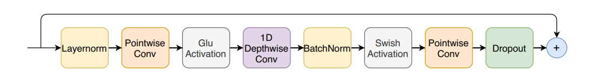
传统卷积：
逐点卷积--PointwiseConv：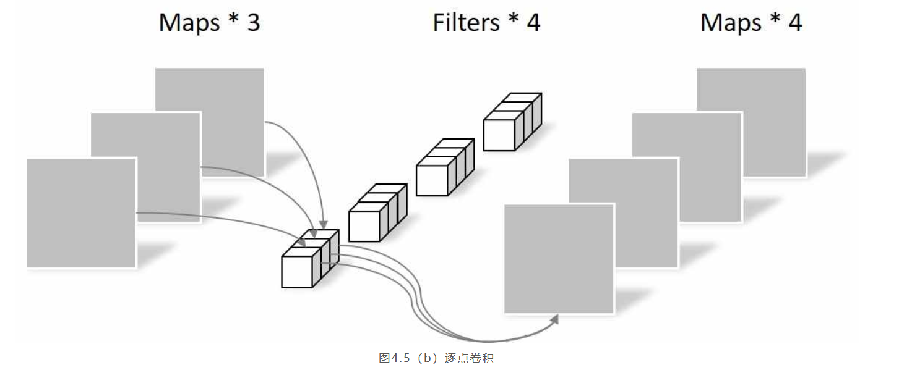
深度卷积--DepthwiseConv：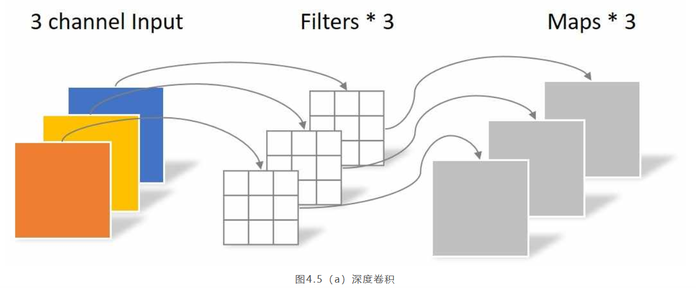
深度可分离卷积（Depthwise Separable Convolution）<https://arxiv.org/abs/1610.02357>
[相关文章--NEU NLPlab](https://school.niutrans.com/qualityArticleInfo?id=94)

### CONTRASTIVE AUDIO-VISUAL MASKED AUTOENCODER

#### 1 WHY
1. 从人类角度认识世界是结合了听觉和视觉
2. 模型越来越大，标记数据过于昂贵----自监督
3. 如何结合两种模态----对比学习
4. MAE在SAT和ViT中达到sota
5. CAV + MAE （innovation）
#### 2 HOW
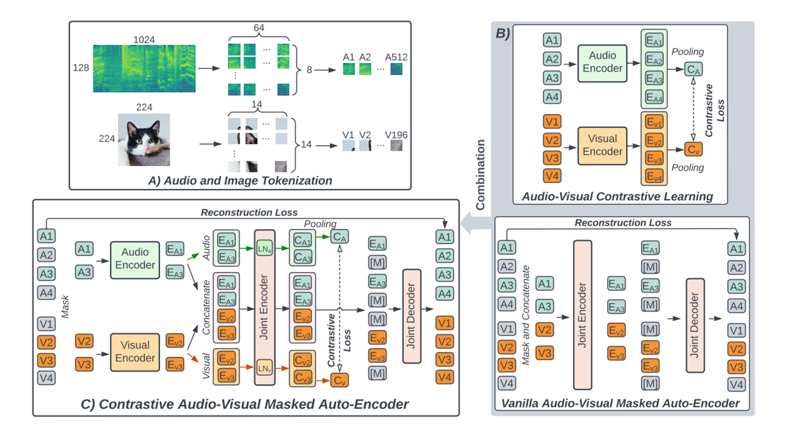
1. CAV ：encode + contrastive loss
2. MAE：self-supervised learing &emsp;[相关解读](https://zhuanlan.zhihu.com/p/439554945)
3. AV-MAE：加入了一个type embedding之后就直接concate放到一个encoder中（对不同的模态采用相同的权重进行训练，效果不好）
4. CAV-MAE：用单模态流进行对比学习（CAV），用多模态流进行重构任务（AV-MAE），最后Loss = contrastive loss + k*reconstruction loss

### Mamba: Linear-Time Sequence Modeling with Selective State Spaces
#### motivation:
transformer模型的二次复杂度：

具体怎么计算得来的呢？

1. 第一步是计算Q​、K​、V​
即 $Q=x W_{Q}, K=x W_{K}, V=x W_{V}$
该矩阵乘法的输入和输出形状为 $[b, N, d] \times[d, d] \rightarrow[b, N, d]​$
计算量为：$3 * 2 b N d^{2}=6 b N d^{2}​$
$\rightarrow$  1，“(b,N,d)看做b个(N,d)，(b,N,d) × (d,d)看做b个(N,d) × (d,d)，(N,d) × (d,d)的计算次数是2Ndd(乘法Ndd、加法再Ndd，当然也有的资料不看加法)b个(N,d) × (d,d)的计算次数就是b2Ndd，也就是$2bN{d}^2$”
$\rightarrow$  2，x的形状是[b,N,d]，W_{Q}的形状是[d,d],Q的形状是[b,N,d]，因为除了Q之外，还得再计算K、V，所以最后会再乘以个3，得到：$6bNd^{2}$
2. 计算$Q K^T​$
该部分的输入和输出形状为
$\left[b, h e a d \_n u m, N, p e r \_h e a d \_h i d d e n \_s i z e\right]​ \times​ \left[b, h e a d \_n u m, p e r \_h e a d \_h i d d e n \_s i z e\right. , N]\rightarrow\left[b, h e a d \_n u m, N, N\right]​$
计算量为：<mark>$2bN^2d$​</mark>
1. 计算在V​上的加权 $score \cdot V​$
该部分矩阵乘法的输入和输出形状为
$\left[b, h e a d \_n u m, N, N\right] \times\left[b, h e a d \_n u m, N, p e r \_h e a d \_h i d d e n \_s i z e\right]​ \rightarrow\left[b, h e a d \_n u m, N, p e r \_h e a d \_h i d d e n \_s i z e\right]​$
计算量为：<mark>$2bN^2d​$</mark>
1. attention后的线性映射，矩阵乘法的输入和输出形状为$[b, N, d] \times[d, d] \rightarrow[b, N, d]​$
计算量为$2bNd^2​$
* 最终自注意力层的输出结果为
$x_{o u t}=\operatorname{softmax}\left(\frac{Q K^{T}}{\sqrt{d}}\right) \cdot V \cdot W_{o}+x$

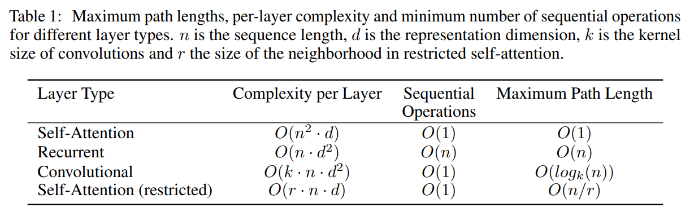

---

#### model:
- Selective State Space Models
	 - Structured state space sequence models (S4) 
		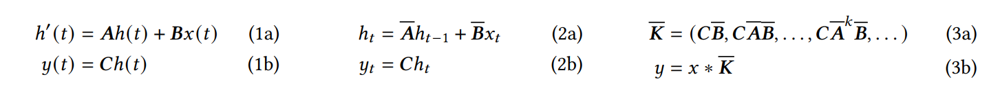
		(1a,1b)控制理论中的方程，(2a,2b)离散化之后的方程，(3a,3b)卷积形式的方程 
		对比RNN方程：
		$\begin{aligned}
		& h_t=\tanh(W_{hh}h_{t-1}+W_{xh}x_t) \\
		& y_t=W_{hy}h_t
		\end{aligned}$ 
		 

		

		
 卷积形式解释 

		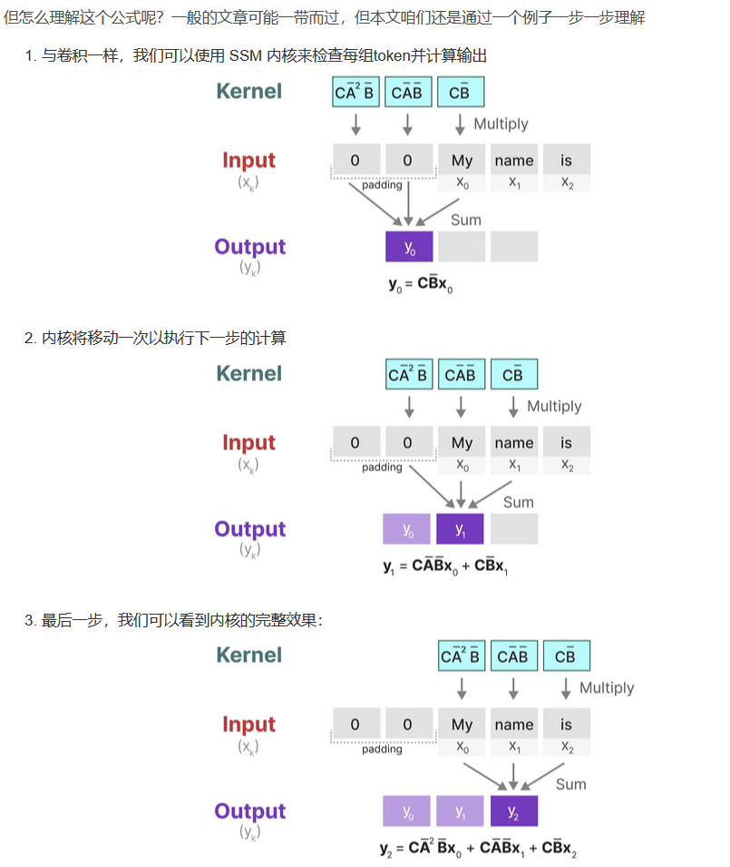
		至于上图中的y_2是咋计算得到的，别忘了我上面推导出来的
		$\begin{aligned} y_{2} & =C h_{2} \\ & =C\left(\bar{A} h_{1}+\bar{B} x_{2}\right) \\ & =C\left(\bar{A}\left({\bar{A} h_{0}+\bar{B} x_{1}}\right)+\bar{B} x_{2}\right) \\ & =C\left(\bar{A}\left(\bar{A} \cdot \bar{B} x_{0}+\bar{B} x_{1}\right)+\bar{B} x_{2}\right) \\ & =C\left(\bar{A} \cdot \bar{A} \cdot \bar{B} x_{0}+\bar{A} \cdot \bar{B} x_{1}+\bar{B} x_{2}\right) \\ & =C \cdot \bar{A}^2 \cdot \bar{B} x_{0}+C \cdot \bar{A} \cdot \bar{B} \cdot x_{1}+C \cdot \bar{B} x_{2} \end{aligned}$
		若推而广之，可得
		$y_{k}=C \bar{A}^{k} \bar{B} x_{0}+C \bar{A}^{k-1} \bar{B} x_{1}+\cdots+C \bar{A} \bar{B} x_{k-1}+C \bar{B} x_{k}$

		此外，换个形式看，是不意味着y_3实际上可以计算为点积，其中右侧向量是我们的输入x
		$y_{3}=\left(\begin{array}{llll} \mathbf{C} \overline{\mathbf{A}} \overline{\mathbf{A}} \overline{\mathbf{A}} \overline{\mathbf{B}} & \mathbf{C} \overline{\mathbf{A}} \overline{\mathbf{A}} \overline{\mathbf{B}} & \mathbf{C} \overline{\mathbf{A}} \overline{\mathbf{B}} & \mathbf{C} \overline{\mathbf{B}} \end{array}\right)\left(\begin{array}{l} x_{0} \\ x_{1} \\ x_{2} \\ x_{3} \end{array}\right)$
		由于其中三个离散参数A、B、C都是常数，因此我们可以预先计算左侧向量并将其保存为卷积核，这为我们提供了一种使用卷积超高速计算y的简单方法，如以下两个方程所示
		$\begin{aligned} \overline{\mathbf{K}} & =\left(\begin{array}{llll} \mathbf{C} \overline{\mathbf{B}} & \mathbf{C} \overline{\mathbf{A}} \overline{\mathbf{B}} & \cdots & \mathbf{C A}^{\mathbf{k}} \overline{\mathbf{B}} \end{array}\right) \\ y & =\overline{\mathbf{K}} * x \end{aligned}$
		(像是一个超前进位加法器)
		

		
		即在训练时用RNN，在推理时用CNN
		 

		使用HIPPO矩阵来增强RNN记忆力
		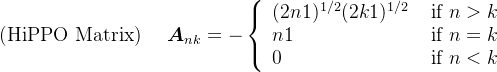
		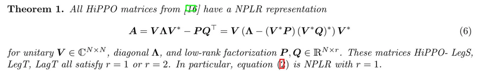
		>$\overline A$矩阵是用来更新 hidden state 的, 而我们知道 RNN 被诟病的一个点恰恰是 hidden state 的记忆能力有限. 想想这个也可以理解, 因为 hidden state 的大小是固定的, 但是需要记忆的内容是随着 sequence length 增加的, 用一个有限的容器去装源源不断的水流, 自然要有溢出.
		Mamba 想要改善这个问题. 她的做法是对$\overline A$搞一些数学. 先来定义一下, 什么叫做一个好的 hidden state 的记忆, 那理想情况肯定就是, 任何时候都可以用$h_{l}$无损恢复所有见过的 input. 这大概率不可能, 那么损小点也行. 这样, 我们就把 hidden state 的记忆能力衡量成了可以有多少损失的恢复 input.
		就像前面的 微分方程 的部分一样, Mamba 用了另外一种理论成果 HiPPO来数学地构建$\overline A$矩阵.

	- Selective State Space Models
		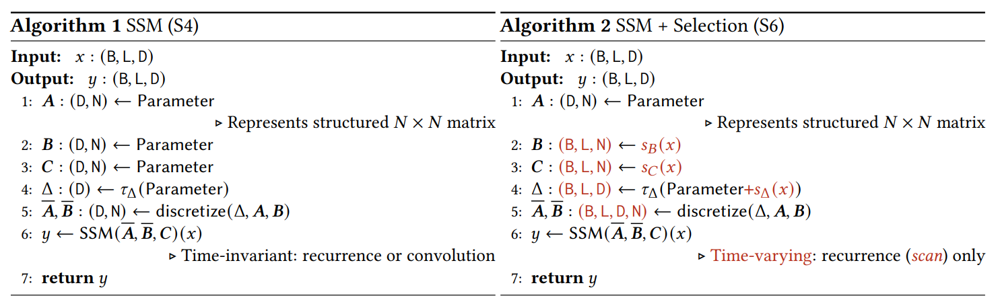
		We specifically choose $𝑠_{𝐵} (𝑥)= Linear_{𝑁} (𝑥), 𝑠_{𝐶} (𝑥) = Linear_{𝑁} (𝑥), 𝑠_{Δ}(𝑥) = Broadcast_{𝐷} (Linear_{1}(𝑥)), and 𝜏_{Δ} = softplus $, where $Linear_{𝑑}$ is a parameterized projection to dimension 𝑑. The choice of $𝑠_{Δ}$ and $𝜏_{Δ}$ is due to a connection to RNN gating mechanisms explained in Section 3.5.

		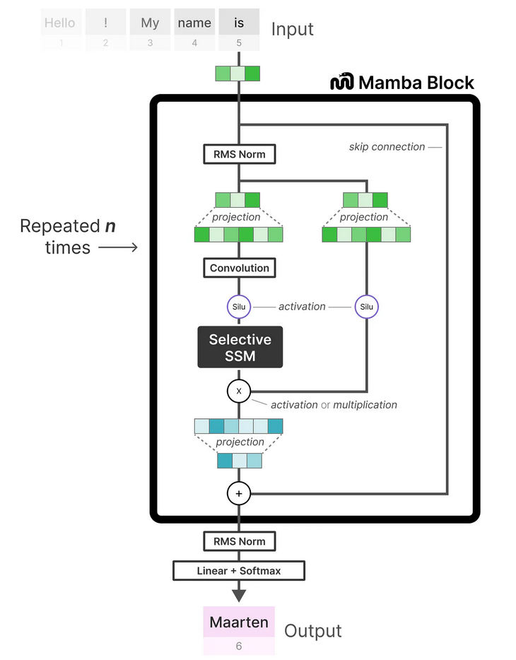
		>为什么SSM前面有个卷积？
		本质是对数据做进一步的预处理，更细节的原因在于：
		$\rightarrow$  SSM之前的CNN负责提取局部特征(因其擅长捕捉局部的短距离特征)，而SSM则负责处理这些特征并捕捉序列数据中的长期依赖关系，两者算互为补充
		$\rightarrow$  CNN有助于建立token之间的局部上下文关系，从而防止独立的token计算
		毕竟如果每个 token 独立计算，那么模型就会丢失序列中 token 之间的上下文信息。通过先进行卷积操作，可以确保在进入 SSM 之前，序列中的每个 token 已经考虑了其邻居 token 的信息。这样，模型就不会单独地处理每个 token，而是在处理时考虑了整个局部上下文

- Hardware-aware Algorithm
  - parallel scan
	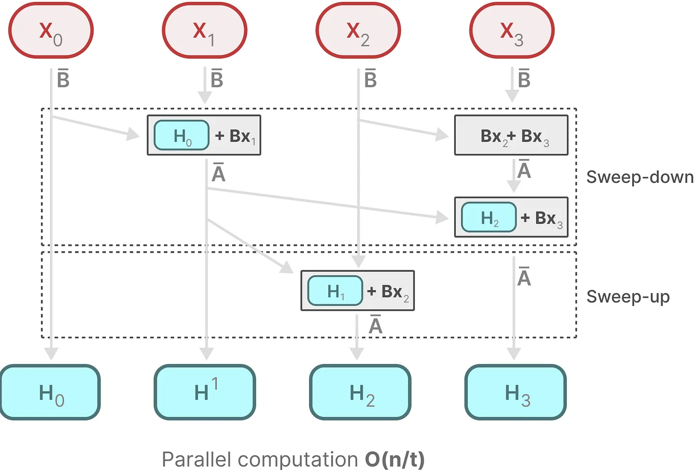
	也就是类似于一个超前进位加法器
  - Flash Attention
  	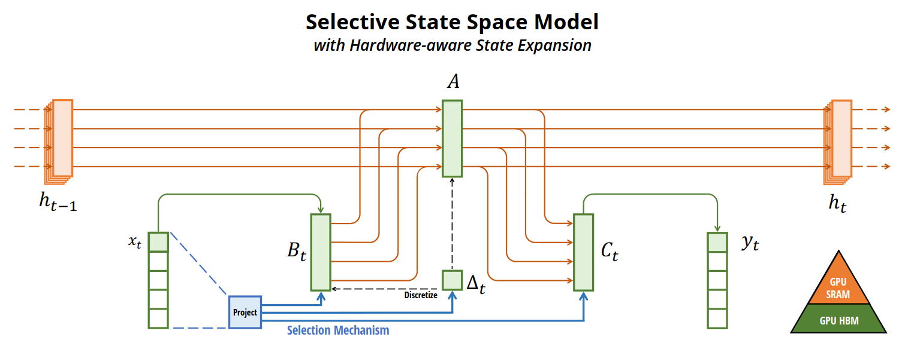

相关连接：
[知乎](https://www.zhihu.com/question/644981978/answer/3405813530?utm_oi=922122523653582848&utm_psn=1749458306760822784)    
[CSDN](https://blog.csdn.net/v_JULY_v/article/details/134923301)
[flash attention](https://arxiv.org/abs/2205.14135)
[linear attention](https://arxiv.org/abs/2007.14902)

  

